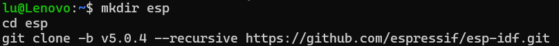

# ESP32-S3-WROOM-1-N16R8
Basado en--Based on:
- [Mythologyli](https://github.com/Mythologyli/MicroPython-ESP32-S3-N16R8)


## Datasheet:

- [ESP-S3-WROOM-1/1U](https://www.espressif.com/sites/default/files/documentation/esp32-s3-wroom-1_wroom-1u_datasheet_en.pdf)

## Docs:
- [ESP-S3 User Guide DevKitC v1.1](https://docs.espressif.com/projects/esp-idf/en/latest/esp32s3/hw-reference/esp32s3/user-guide-devkitc-1.html)


## ESP-IDF:
- [ESP-IDF](https://docs.espressif.com/projects/esp-idf/en/stable/esp32s3/get-started/linux-macos-setup.html)
  
## MicroPython
- [MicroPython](https://github.com/micropython/micropython/blob/master/ports/esp32/README.md)


# MicroPython ESP32-S3 N16R8

# Probado en -- Tested on Ubuntu WSL 2024:

- ```bash
  wsl --install Ubuntu
  ```


### Una vez instalado Ubuntu -- Once Installed Ubuntu:

#### Actualizar e instalar requerimientos -- Update and Install Requirements:

- ```bash
  sudo apt update && sudo apt upgrade -y
  ```
  
  
- ```bash
  sudo apt install -y build-essential git wget flex bison gperf pkg-config python3 python3-pip python3-venv cmake ninja-build ccache libffi-dev libssl-dev dfu-util libusb-1.0-0
  ```
  


### Clonar ésta repo -- Clone this repo, MicroPython y ESP-IDF compatible con MicroPython(En la actualidad "Micropython 1.24" 5.04 a 5.2.2):

- ```bash
  git clone https://github.com/PIBSAS/ESP32-S3-WROOM-1-N16R8.git
  ```
  
  
- ```bash
  git clone https://github.com/micropython/micropython.git
  ```
  


### ESP-IDF v5.0.4:
- ```bash
  mkdir esp
  cd esp
  git clone -b v5.0.4 --recursive https://github.com/espressif/esp-idf.git
  ```
  


### ESP-IDF v5.2:
- ```bash
  mkdir esp
  cd esp
  git clone -b v5.2 --recursive https://github.com/espressif/esp-idf.git
  ```


### ESP-IDF v5.2.2:
- ```bash
  mkdir esp
  cd esp
  git clone -b v5.2.2 --recursive https://github.com/espressif/esp-idf.git
  ```


### Instalar CMake mediante -- Install CMake with ``idf_tools.py``:

- ```bash
  cd esp-idf/tools
  ```
  
- ```bash
  python3 idf_tools.py install cmake
  ```
  

### Regresar un directorio y ejecutar el script para ESP32S3 -- Back a directory and execute the Script for ESP32S3:

- ```bash
  cd ..
  ./install.sh esp32s3
  ```
  
  
### Ejecutar -- Run:
- ```bash
  . ./export.sh
  ```


### Copiar el directorio ``ESP32_GENERIC_S3_N16R8`` y su contenido al directorio boards -- Copy recursively ``ESP32_GENERIC_S3_N16R8`` folder and his content to boards folder:

- ```bash
  cd
  cp -r ESP32-S3-WROOM-1-N16R8/ESP32_GENERIC_S3_N16R8 micropython/ports/esp32/boards
  ```


### Dirigirnos al directorio MicroPython y ejecutar mpy-cross -- Go to MicroPython folder and run mpy-cross:

- ```bash
  cd
  cd micropython/
  make -C mpy-cross
  ```


### Indicar el ``IDF_TARGET`` -- Indicate ``IDF_TARGET``:

- ```bash
  export IDF_TARGET=esp32s3
  ```


### Movernos a -- Move to ```ports/esp32```:

- ```bash
  cd ports/esp32/
  ```

### Compilar MicroPython para ESP32 S3 -- Compile MicroPython for ESP32 S3:

- ```bash
  make BOARD=ESP32_GENERIC_S3_N16R8 submodules
  ```
- ```bash
  make BOARD=ESP32_GENERIC_S3_N16R8
  ```


#### Al final con ESP-IDF v5.0.4 nos indica -- At the end show us with ESP-IDF v5.0.4:

- Project build complete. To flash, run this command:
- ```bash
  $HOME/.espressif/python_env/idf5.0_py3.10_env/bin/python ../../../esp/esp-idf/components/esptool_py/esptool/esptool.py -p (PORT) -b 460800 --before default_reset --after no_reset --chip esp32s3  write_flash --flash_mode dio --flash_size 16MB --flash_freq 80m 0x0 build-ESP32_GENERIC_S3_N16R8/bootloader/bootloader.bin 0x8000 build-ESP32_GENERIC_S3_N16R8/partition_table/partition-table.bin 0x10000 build-ESP32_GENERIC_S3_N16R8/micropython.bin
  ```


#### Or run 'idf.py -p (PORT) flash':

| bootloader  |  @0x000000  |  18672  (   14096 remaining)  |
|-------------|-------------|-------------------------------|
| partitions  | @0x008000   |   3072  (    1024 remaining)  |
| application | @0x010000   | 1396208  (  635408 remaining) |
| total       |             | 1461744                       |

- Se debe cambiar ``(PORT)`` por ``COM29`` por ejemplo o en linux ``/dev/ttyACM0``


#### Al final con ESP-IDF v5.2 nos indica -- At the end show us with ESP-IDF v5.2:

- Project build complete. To flash, run this command:
- ```bash
  python -m esptool --chip esp32s3 -b 460800 --before default_reset --after no_reset write_flash --flash_mode dio --flash_size 16MB --flash_freq 80m 0x0 build-ESP32_GENERIC_S3_N16R8/bootloader/bootloader.bin 0x8000 build-ESP32_GENERIC_S3_N16R8/partition_table/partition-table.bin 0x10000 build-ESP32_GENERIC_S3_N16R8/micropython.bin
  ```


#### Al final con ESP-IDF v5.2.2 nos indica -- At the end show us with ESP-IDF v5.2.2:

- Project build complete. To flash, run this command:
- ```bash
  python -m esptool --chip esp32s3 -b 460800 --before default_reset --after no_reset write_flash --flash_mode dio --flash_size 16MB --flash_freq 80m 0x0 build-ESP32_GENERIC_S3_N16R8/bootloader/bootloader.bin 0x8000 build-ESP32_GENERIC_S3_N16R8/partition_table/partition-table.bin 0x10000 build-ESP32_GENERIC_S3_N16R8/micropython.bin
  ```
  
# Windows:

## ESP-IDF v5.0.4:
### Borramos la flash -- Erase flash:
- ```bash
  $HOME/.espressif/python_env/idf5.0_py3.10_env/bin/python ../../../esp/esp-idf/components/esptool_py/esptool/esptool.py -p /dev/ttyACM0 erase_flash
  ```


### Luego flasheamos -- Then flash:
- ```bash
  $HOME/.espressif/python_env/idf5.0_py3.10_env/bin/python ../../../esp/esp-idf/components/esptool_py/esptool/esptool.py -p COM29 -b 460800 --before default_reset --after no_reset --chip esp32s3  write_flash --flash_mode dio --flash_size 16MB --flash_freq 80m 0x0 build-ESP32_GENERIC_S3_N16R8/bootloader/bootloader.bin 0x8000 build-ESP32_GENERIC_S3_N16R8/partition_table/partition-table.bin 0x10000 build-ESP32_GENERIC_S3_N16R8/micropython.bin
  ```


## ESP-IDF v5.2:

- ```bash
  python -m esptool --chip esp32s3 -b 460800 --before default_reset --after no_reset write_flash --flash_mode dio --flash_size 16MB --flash_freq 80m 0x0 build-ESP32_GENERIC_S3_N16R8/bootloader/bootloader.bin 0x8000 build-ESP32_GENERIC_S3_N16R8/partition_table/partition-table.bin 0x10000 build-ESP32_GENERIC_S3_N16R8/micropython.bin
  ```

## ESP-IDF v5.2.2:

- ```bash
  python -m esptool --chip esp32s3 -b 460800 --before default_reset --after no_reset write_flash --flash_mode dio --flash_size 16MB --flash_freq 80m 0x0 build-ESP32_GENERIC_S3_N16R8/bootloader/bootloader.bin 0x8000 build-ESP32_GENERIC_S3_N16R8/partition_table/partition-table.bin 0x10000 build-ESP32_GENERIC_S3_N16R8/micropython.bin
  ```

# WSL:

## Instalar -- Install USBIPD:

- ```bash
  winget install --interactive --exact dorssel.usbipd-win
  ```

### Abrir Terminal(Administrador) conectar el ESP32 y escribir -- Open Terminasl(Admin) plug ESP32 and type:

- ```bash
  usbipd list
  ```
- Observar el -- See ``BUSID`` del -- of esp ``(USB-Enhanced-SERIAL CH343 (COM29)``. Ej: ``2-1``

### Escribir -- Type:

- ```bash
  usbipd bind --busid 2-1
  ```

- ```bash
  usbipd attach --wsl --busid 2-1
  ```

### En WSL Ubuntu(Distro) agregar el usuario al grupo ``dialout`` -- On WSL Ubuntu add user to ``dialout`` group:

- ```bash
  sudo adduser $USER dialout
  ```

### En Terminal(Administrador) Comprobar que figure ``Attached`` en la columna ``STATE`` con -- On Teminal(Admin) Verify ``Attached`` on ``STATE`` column with:

- ```bash
  usbipd list
  ```
## ESP-IDF v5.0.4:
### Luego en WSL borramos la flash -- Then on WSL erase the flash:

- ```bash
  $HOME/.espressif/python_env/idf5.0_py3.10_env/bin/python ../../../esp/esp-idf/components/esptool_py/esptool/esptool.py -p /dev/ttyACM0 erase_flash
  ```
  
### Luego flasheamos -- Then flash:
- ```bash
  $HOME/.espressif/python_env/idf5.0_py3.10_env/bin/python ../../../esp/esp-idf/components/esptool_py/esptool/esptool.py -p /dev/ttyACM0 -b 460800 --before default_reset --after no_reset --chip esp32s3  write_flash --flash_mode dio --flash_size 16MB --flash_freq 80m 0x0 build-ESP32_GENERIC_S3_N16R8/bootloader/bootloader.bin 0x8000 build-ESP32_GENERIC_S3_N16R8/partition_table/partition-table.bin 0x10000 build-ESP32_GENERIC_S3_N16R8/micropython.bin
  ```

## ESP-IDF v5.2:
- ```bash
  python -m esptool --chip esp32s3 -b 460800 --before default_reset --after no_reset write_flash --flash_mode dio --flash_size 16MB --flash_freq 80m 0x0 build-ESP32_GENERIC_S3_N16R8/bootloader/bootloader.bin 0x8000 build-ESP32_GENERIC_S3_N16R8/partition_table/partition-table.bin 0x10000 build-ESP32_GENERIC_S3_N16R8/micropython.bin
  ```  

## ESP-IDF v5.2.2:
- ```bash
  python -m esptool --chip esp32s3 -b 460800 --before default_reset --after no_reset write_flash --flash_mode dio --flash_size 16MB --flash_freq 80m 0x0 build-ESP32_GENERIC_S3_N16R8/bootloader/bootloader.bin 0x8000 build-ESP32_GENERIC_S3_N16R8/partition_table/partition-table.bin 0x10000 build-ESP32_GENERIC_S3_N16R8/micropython.bin
  ```  

#### After flash detach the board with usbipd so is available for Windows:
- ```bash
  usbipd detach --busid 2-1
  ```  

# Linux:

- ```bash
  $HOME/.espressif/python_env/idf5.0_py3.10_env/bin/python ../../../esp/esp-idf/components/esptool_py/esptool/esptool.py -p /dev/ttyACM0 erase_flash
  ```
- ```bash
  $HOME/.espressif/python_env/idf5.0_py3.10_env/bin/python ../../../esp/esp-idf/components/esptool_py/esptool/esptool.py -p /dev/ttyACM0 -b 460800 --before default_reset --after no_reset --chip esp32s3  write_flash --flash_mode dio --flash_size 16MB --flash_freq 80m 0x0 build-ESP32_GENERIC_S3_N16R8/bootloader/bootloader.bin 0x8000 build-ESP32_GENERIC_S3_N16R8/partition_table/partition-table.bin 0x10000 build-ESP32_GENERIC_S3_N16R8/micropython.bin
  ```

## Reference

- [micropython/micropython/issues/8635](https://github.com/micropython/micropython/issues/8635#issuecomment-1129218506)

## Resultado -- Result:

### ESP-IDF v5.0.4:


### ESP-IDF v5.2:


# The Lazy way:
- Just Download the Firmware ZIP file(old now[August 2024]), Unzip and read the How To text file.

> :warning: Files need to be where is esptool or type full path of files ⚠️

## Install ESPtool:
- ```bash
  pip install esptool
  ```

### Replace (PORT)"Doesn't need port", with yours Linux: /dev/ttyACM0 Windows: COM12 (After com goes the number detected on your pc)

### Erase flash:
- Linux(On Ubuntu python3 instead just python): ````python -m esptool erase_flash````
- Windows: ````python -m esptool erase_flash````
- Windows with Virtual Environment: ````esptool erase_flash````


### Flash:
- ```bash
  python -m esptool -b 460800 --before default_reset --after no_reset --chip esp32s3  write_flash --flash_mode dio --flash_size 16MB --flash_freq 80m 0x0 bootloader/bootloader.bin 0x8000 partition_table/partition-table.bin 0x10000 micropython.bin
  ```

#### Windows with Virtual Environment:
- ```bash
  esptool -b 460800 --before default_reset --after no_reset --chip esp32s3  write_flash --flash_mode dio --flash_size 16MB --flash_freq 80m 0x0 bootloader/bootloader.bin 0x8000 partition_table/partition-table.bin 0x10000 micropython.bin
  ```


> :warning: For pip on newest OSes you need to make virtual environment:

### Windows:
- ```bash
  python -m venv esp-env
  ```
or
- ```bash
  py -m venv esp-env
  .\esp-env\Scripts\activate
Once activated install esptool:
- (esp-env)PS C:....> ```pip install esptool```


### Linux:
- ```bash
  python .m venv esp-env
  source esp-env/bin/activate
  ```
Once activated install esptool:
- (esp-env) ...$: ```pip install esptool```

### ESP Tool Docs:
- [ESP Tool Documentation](https://docs.espressif.com/projects/esptool/en/latest/esp32s3/esptool/index.html#esptool)

### If you want add Libraries to your build, then copy them to ``micropython/ports/esp32/modules/`` folder all ``*.py`` you want, look the space left, becarefull.

# Smartconfig Apps from:
- [ESP-Touch for Android](https://www.espressif.com/en/support/download/apps)
- [ESP-Touch for iOS](https://www.espressif.com/en/support/download/apps)
- Smartconfig example in [smartconfig_example](smartconfig_example) folder in this repo.
